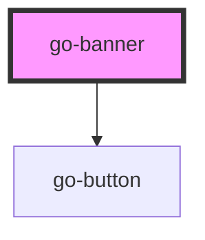

# Banner `go-banner`

<!-- Description -->

Banner is a component in Go UI.

## Usage

Banner can be used inside a container or by itself on top of the page (global banner).

A banner draws the users' attention to the content. The banner can be used to display a message, a success feedback, or an error.

## Demo

<demo-frame component="go-banner" demo="go-banner" />

<!-- Auto Generated Below -->

## Usage

### Go-banner

<link rel="stylesheet" href="https://fonts.googleapis.com/icon?family=Material+Icons" />

<wc-playground
  tag="go-banner"
  props="[
    {name: 'heading', type: 'string'},
    {name: 'dismissible', type: 'boolean'},
    {name: 'variant', type: 'select', options: ['info', 'critical', 'success']},
  ]"
  slots='[
  {
    "name": "default",
    "docs": "Banner content"
  },
  {
    "name": "icon",
    "docs": "Slot for banner icon"
  }
]'
  code="
  <go-banner variant='info' heading='Banner heading'>
    <go-icon decorative='true' slot='icon' name='lightbulb'></go-icon>
    Lorem ipsum dolor sit amet consectetur adipisicing elit. Qui quis voluptatum commodi, earum laudantium dolorem deleniti animi, natus sed aperiam.
  </go-banner>
"
>
</wc-playground>

### Go-banner-global

<go-banner global="true" variant="info" heading="Info heading">
  Lorem ipsum dolor sit amet consectetur adipisicing elit. Qui quis voluptatum commodi, earum laudantium dolorem deleniti animi, natus sed aperiam
  necessitatibus doloribus, laborum numquam atque voluptatem officia neque adipisci.
</go-banner>

## Properties

| Property      | Attribute     | Description                                                     | Type                                | Default     |
| ------------- | ------------- | --------------------------------------------------------------- | ----------------------------------- | ----------- |
| `dismissible` | `dismissible` | If the banner can be dismissed, a close button will be rendered | `boolean`                           | `false`     |
| `heading`     | `heading`     | Heading of banner                                               | `string`                            | `undefined` |
| `variant`     | `variant`     | Type of banner                                                  | `"critical" \| "info" \| "success"` | `'info'`    |

## Events

| Event       | Description | Type                |
| ----------- | ----------- | ------------------- |
| `dismissed` |             | `CustomEvent<void>` |

## CSS Custom Properties

| Name                                                                                 | Description                                                                                    |
| ------------------------------------------------------------------------------------ | ---------------------------------------------------------------------------------------------- |
| `--banner-bg-color`                                                                  | Background color for banner. - default: var(--go-color-primary-100)                            |
| `--banner-border-color`                                                              | Define the border color for left decorative banner bar. - default: var(--go-color-primary-300) |
| `--banner-border-width`                                                              | Define the border width for hte left decorative banner bar. - default: 0.5rem                  |
| `--banner-fg-color`                                                                  | Foreground color for banner - default: var(--go-color-darkest)                                 |
| `--banner-heading-gap The gap between the heading and the content. - default 0.5rem` |                                                                                                |
| `--banner-icon-bar-padding`                                                          | Padding for icon bar - default: 0.5rem                                                         |
| `--banner-padding-x`                                                                 | Horizontal padding of banner area - default: 1rem                                              |
| `--banner-padding-y`                                                                 | Vertical padding of banner area - default: 1.5rem                                              |
| `--banner-radius`                                                                    | Define border radius for banner. - default: var(--radius-2)                                    |
| `--banner-shadow`                                                                    | Shadow for banner - default: var(--shadow-1)                                                   |

## Dependencies

### Depends on

- [go-button](../go-button)

### Graph

----------------------------------------------

*Built with [StencilJS](https://stenciljs.com/)*
