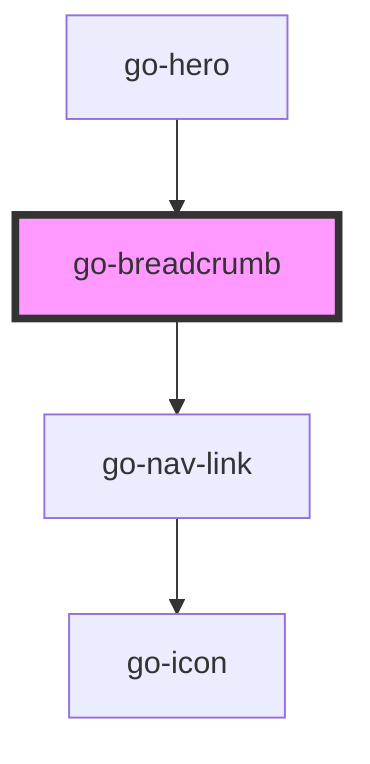

## go-breadcrumbs API

<!-- Auto Generated Below -->

## Properties

| Property      | Attribute      | Description                                                                                             | Type                   | Default        |
| ------------- | -------------- | ------------------------------------------------------------------------------------------------------- | ---------------------- | -------------- |
| `hideCurrent` | `hide-current` | Hide current page (last item without url) from the breadcrumb                                           | `boolean`              | `false`        |
| `items`       | `items`        | list of navigation items to be displayed                                                                | `INavItem[] \| string` | `undefined`    |
| `label`       | `label`        | The label for the navigation landmark. This is used by assistive technologies to identify the landmark. | `string`               | `'Breadcrumb'` |

## Dependencies

### Used by

 - [go-hero](../go-hero)

### Depends on

- [go-nav-link](../navigation/go-nav-link)

### Graph

----------------------------------------------

