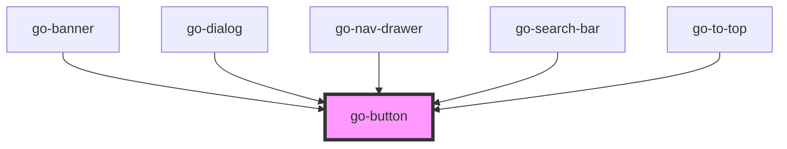

# Button `go-button`

A button is a simple way to call on the attention of the user.

## When to use

Use a button when you want to:

- Call on the user's attention.
- Provide a way to initiate an action or a navigation (see [buttons vs links](#buttons-vs-links)).
- Provide a command that the user can execute, such as saving data or submitting a form.

## Accessibility

- Buttons must have discernible text. (https://www.w3.org/WAI/WCAG21/Techniques/aria/ARIA14)

  Most of the time, the text within button slot will be sufficient, when using icon buttons, we check if there is a `aria-label` or `aria-labelledby` attribute on the button, and a console warning will be thrown if there is not.

- Elements must have significant color contrast.

## Demo

<demo-frame component="go-button" demo="go-button" no-source></demo-frame>

## Block level

It is often nice to make the button more prominent on mobile devices by making it a full-width. This accommodates for the limited screen real-estate. You can specify at which device/breakpoint you want the button to be full-width by passing the breakpoint keyword into the `block` attribute. (If `block` attribute is present but no value is specified, the button will be full-width at all breakpoints.)

<demo-frame component="go-button" demo="block"></demo-frame>

## Icons

Button can be icon-only, the only caveat is that you'll need to provide `aria-label` or `aria-labelledby` attributes for accessibility.

<demo-frame component="go-button" demo="icons"></demo-frame>

## Buttons vs links

For a comprehensive breakdown of buttons and links, see [A Complete Guide to Links and Buttons](https://css-tricks.com/a-complete-guide-to-links-and-buttons/) from CSS Tricks.
Buttons and links may feel similar but they serve different purposes and have different accessibility requirements.

> Buttons are used for actions that affect the website's front-end or back-end; links are used for navigation and actions that don't affect the website at all.
>
> -- <cite>[UX Office](https://ux.iu.edu/writings/buttons-vs-links-basic/)</cite>

<demo-frame component="go-button" demo="button-link"></demo-frame>

<!-- Auto Generated Below -->

## Usage

### Block

  <!-- block -->
  
Full width on all devices

  <go-button block="all" variant="primary">Button</go-button>

  
Full width on mobile, inline from tablet onwards

  <go-button block="mobile" variant="primary">Button</go-button>

  
Full width on mobile and tablet, inline from desktop onwards

  <go-button block="tablet" variant="primary">Button</go-button>

  
Full width on mobile, tablet and desktop, inline from large onwards

  <go-button block="desktop" variant="primary">Button</go-button>

### Button-link

  <h3>Button vs links</h3>
  
While there are times when you want to style links as buttons, it's often not the right approach if you want to style buttons as links.

  <go-button variant="primary" href="https://google.com" target="_blank" rel="noopener noreferrer nofollow">I'm a link styled like a button</go-button>

### Go-button

<link rel="stylesheet" href="https://fonts.googleapis.com/icon?family=Material+Icons" />

  <go-button>Neutral (Default)</go-button>
  <go-button variant="primary">Primary</go-button>
  <go-button variant="secondary">Secondary</go-button>
  <go-button variant="success">Success</go-button>
  <go-button variant="critical">Critical</go-button>
  <go-button variant="text">Text</go-button>

  

  <go-button compact>Neutral (Default)</go-button>
  <go-button compact variant="primary">Primary</go-button>
  <go-button compact variant="secondary">Secondary</go-button>
  <go-button compact variant="success">Success</go-button>
  <go-button compact variant="critical">Critical</go-button>
  <go-button compact variant="text">Text</go-button>

  

  <go-button outline="true">Neutral (Default)</go-button>
  <go-button outline="true" variant="primary">Primary</go-button>
  <go-button outline="true" variant="secondary">Secondary</go-button>
  <go-button outline="true" variant="success">Success</go-button>
  <go-button outline="true" variant="critical">Critical</go-button>
  <go-button outline="true" variant="text">Text</go-button>

  

  <go-button outline="true" flat="true">Neutral (Default)</go-button>
  <go-button outline="true" flat="true" variant="primary">Primary</go-button>
  <go-button outline="true" flat="true" variant="secondary">Secondary</go-button>
  <go-button outline="true" flat="true" variant="success">Success</go-button>
  <go-button outline="true" flat="true" variant="critical">Critical</go-button>
  <go-button outline="true" flat="true" variant="text">Text</go-button>

  

  <go-button outline="true" flat="true" round>Neutral (Default)</go-button>
  <go-button outline="true" flat="true" round variant="primary">Primary</go-button>
  <go-button outline="true" flat="true" round variant="secondary">Secondary</go-button>
  <go-button outline="true" flat="true" round variant="success">Success</go-button>
  <go-button outline="true" flat="true" round variant="critical">Critical</go-button>
  <go-button outline="true" flat="true" round variant="text">Text</go-button>
<!--
  <wc-playground
    tag="go-button"
    props="[
      {name: 'variant', type: 'select', value: 'neutral', 'options': ['neutral','primary','secondary','tertiary','critical','text']},
      {name: 'outline', type: 'boolean', value: false},
      {name: 'outlineFill', type: 'boolean', value: false},
      {name: 'flat', type: 'boolean', value: false},
      {name: 'disabled', type: 'boolean', value: false},
      {name: 'round', type: 'boolean', value: false},
      {name: 'compact', type: 'boolean', value: false},
    ]"
    slots='[
        {
          "name": "default",
          "docs": "Button text"
        },
        {
          "name": "prefix",
          "docs": "Use this slot to prepend content to the button."
        },
        {
          "name": "suffix",
          "docs": "Use this slot to append content to the button."
        }
    ]'
    code='<go-button type="button">
      Button
    </go-button>'
  >

  </wc-playground> -->

### Icons

<link rel="stylesheet" href="https://fonts.googleapis.com/icon?family=Material+Icons" />

  
Additional icon font CSS required, see source code for details.

  <go-button icon aria-label="Search button" variant="primary">
    <go-icon decorative name="search"></go-icon>
    Search
  </go-button>

  <go-button icon aria-label="Search button" outline variant="primary">
    <go-icon decorative name="search"></go-icon>
    Search
  </go-button>

  <go-button icon aria-label="Search button" outline round variant="primary">
    <go-icon decorative name="search"></go-icon>
    Search
  </go-button>

  <go-button icon aria-label="Search button" flat variant="primary">
    <go-icon decorative name="search"></go-icon>
    Search
  </go-button>

## Properties

| Property      | Attribute      | Description                                                                                                                                                                                                                                                                                                 | Type                                                                         | Default     |
| ------------- | -------------- | ----------------------------------------------------------------------------------------------------------------------------------------------------------------------------------------------------------------------------------------------------------------------------------------------------------- | ---------------------------------------------------------------------------- | ----------- |
| `block`       | `block`        | If set, the button will take up the full width of its parent If block="{breakpoint}" is set, the button will take up the full width for the specified breakpoint. e.g. a `block="mobile"` button will display full width on mobile devices. If block="all", the button will take full width on all devices. | `"all" \| "desktop" \| "large" \| "mobile" \| "tablet"`                      | `undefined` |
| `compact`     | `compact`      | Reduce inner gaps and outer paddings                                                                                                                                                                                                                                                                        | `boolean`                                                                    | `false`     |
| `disabled`    | `disabled`     | If this button is disabled                                                                                                                                                                                                                                                                                  | `boolean`                                                                    | `null`      |
| `flat`        | `flat`         | If `flat` is set, the button will have no shadow and will be filled with the background color of the selected variant                                                                                                                                                                                       | `boolean`                                                                    | `false`     |
| `href`        | `href`         | If the button has an href, it will be rendered as an anchor tag                                                                                                                                                                                                                                             | `string`                                                                     | `undefined` |
| `icon`        | `icon`         | Circle shaped icon only button that has min size of 40px for touch devices                                                                                                                                                                                                                                  | `boolean`                                                                    | `false`     |
| `outline`     | `outline`      | If `outline` is true, the button will have a border based on selected variant                                                                                                                                                                                                                               | `boolean`                                                                    | `false`     |
| `outlineFill` | `outline-fill` | Outline style with filled background                                                                                                                                                                                                                                                                        | `boolean`                                                                    | `false`     |
| `round`       | `round`        | If button should have pill-shaped corners                                                                                                                                                                                                                                                                   | `boolean`                                                                    | `false`     |
| `stack`       | `stack`        | Stack elements inside the button                                                                                                                                                                                                                                                                            | `boolean`                                                                    | `false`     |
| `type`        | `type`         | Html type of the button                                                                                                                                                                                                                                                                                     | `"button" \| "reset" \| "submit"`                                            | `'button'`  |
| `variant`     | `variant`      | Button variants                                                                                                                                                                                                                                                                                             | `"critical" \| "neutral" \| "primary" \| "secondary" \| "success" \| "text"` | `'neutral'` |

## Slots

| Slot        | Description                                     |
| ----------- | ----------------------------------------------- |
| `"default"` | Button text                                     |
| `"prefix"`  | Use this slot to prepend content to the button. |
| `"suffix"`  | Use this slot to append content to the button.  |

## CSS Custom Properties

| Name                        | Description                                              |
| --------------------------- | -------------------------------------------------------- |
| `--go-btn-bg-color`         | Background colour for the button. - default: transparent |
| `--go-btn-icon-size`        | Outer size of the icon button. - default: 3rem           |
| `--go-btn-inline-icon-size` | Size of the icon inside the button. - default: 1.5rem    |

## Dependencies

### Used by

 - [go-banner](../go-banner)
 - [go-dialog](../go-dialog)
 - [go-nav-drawer](../navigation/go-nav-drawer)
 - [go-search-bar](../go-search-bar)
 - [go-to-top](../go-to-top)

### Graph

----------------------------------------------

*Built with [StencilJS](https://stenciljs.com/)*
