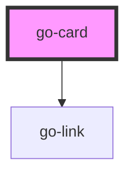

## go-card API

<!-- Auto Generated Below -->

## Usage

### Go-card

<wc-playground
  tag="go-card"
  props="[
    {name: 'cardTitle', type: 'string'},
    {name: 'cardSubtitle', type: 'string'},
    {name: 'mediaPosition', attr: 'media-position', type: 'select', options: ['top', 'left', 'right', 'bottom']},
    {name: 'href', attr: 'href', type: 'string'},
    {name: 'flat', attr: 'flat', type: 'boolean'},
    {name: 'border', attr: 'border', type: 'boolean'}
  ]"
  slots='[
  {
    "name": "custom-title",
    "docs": "Slot for custom card title"
  },
  {
    "name": "default",
    "docs": "Card content"
  },
  {
    "name": "footer",
    "docs": "Slot for card footer markup"
  },
  {
    "name": "media",
    "docs": "Slot for media markup for media card"
  },
  {
    "name": "pre-title",
    "docs": "Slot for content above the card title"
  }
]'
  code="
<go-card card-title='Basic card' card-subtitle='Subtitle'>
  Lorem ipsum dolor, sit amet consectetur adipisicing elit. Atque natus autem veritatis architecto facilis

  
  
Active 2 hours ago

  

    <go-button variant='primary'>Button</go-button>
  

</go-card>
">
</wc-playground>

### Go-card-footer-slot

  

    

      <go-card card-title="Title" card-subtitle="Subtitle">
        Lorem ipsum dolor sit amet consectetur adipisicing elit. Atque natus autem veritatis architecto facilis
        <go-button-group slot="footer">
          <go-button type="button" variant="primary">Primary</go-button>
          <go-button type="button" variant="secondary">Secondary</go-button>
        </go-button-group>
      </go-card>
    

    

      <go-card card-title="Title" card-subtitle="Subtitle">
        Lorem ipsum dolor sit amet consectetur adipisicing elit. Atque natus autem veritatis architecto facilis Lorem ipsum dolor sit amet consectetur dolor sit
        amet consectetur adipisicing elit. Atque natus autem veritatis architecto facilis Lorem ipsum dolor sit amet consectetur adipisicing elit. Atque natus
        facilis
        <go-button-group slot="footer">
          <go-button type="button" variant="primary">Primary</go-button>
          <go-button type="button" variant="secondary">Secondary</go-button>
        </go-button-group>
      </go-card>
    

    

      <go-card card-title="Title" card-subtitle="Subtitle">
        Lorem ipsum dolor sit amet consectetur adipisicing elit. Atque natus autem veritatis architecto facilis Lorem ipsum dolor sit amet consectetur
        
Lorem ipsum dolor sit.

      </go-card>
    

  

### Go-card-links

  

    

      <go-card card-title="Title" card-subtitle="Subtitle" href="#">
        Lorem ipsum dolor sit amet consectetur adipisicing elit. Atque natus autem veritatis architecto facilis
      </go-card>
    

    

      <go-card card-title="External link" card-subtitle="Subtitle" href="https://seanwuapps.com">
        Lorem ipsum dolor sit amet consectetur adipisicing elit. Atque natus autem veritatis architecto facilis
      </go-card>
    

  

## Properties

| Property        | Attribute        | Description                                                                                                                                                                                                                                                           | Type                                                         | Default     |
| --------------- | ---------------- | --------------------------------------------------------------------------------------------------------------------------------------------------------------------------------------------------------------------------------------------------------------------- | ------------------------------------------------------------ | ----------- |
| `border`        | `border`         | Show border on card                                                                                                                                                                                                                                                   | `boolean`                                                    | `false`     |
| `cardSubtitle`  | `card-subtitle`  | Subtitle of the card                                                                                                                                                                                                                                                  | `string`                                                     | `undefined` |
| `cardTitle`     | `card-title`     | Title of the card                                                                                                                                                                                                                                                     | `string`                                                     | `undefined` |
| `flat`          | `flat`           | Flat card without box-shadow                                                                                                                                                                                                                                          | `boolean`                                                    | `false`     |
| `href`          | `href`           | For cards that link to destinations, one card can only link to one destination. Note: The link (`a` tag) will be applied to the card-title element, so if you don't have a `card-title` prop, you will need to manually add the `a` tag in one of the slots provided. | `string`                                                     | `undefined` |
| `mediaPosition` | `media-position` | Position of featured media in the card                                                                                                                                                                                                                                | `"bottom" \| "end" \| "left" \| "right" \| "start" \| "top"` | `'top'`     |
| `target`        | `target`         | when href is present, `target` attribute to be applied to the card link                                                                                                                                                                                               | `"_blank" \| "_parent" \| "_self" \| "_top"`                 | `undefined` |

## Slots

| Slot             | Description                           |
| ---------------- | ------------------------------------- |
| `"custom-title"` | Slot for custom card title            |
| `"default"`      | Card content                          |
| `"footer"`       | Slot for card footer markup           |
| `"media"`        | Slot for media markup for media card  |
| `"pre-title"`    | Slot for content above the card title |

## CSS Custom Properties

| Name                              | Description                                                                                                             |
| --------------------------------- | ----------------------------------------------------------------------------------------------------------------------- |
| `--go-card-bg`                    | Background colour of card                                                                                               |
| `--go-card-border-color`          | Border color for card (for `border` card only) - default: var(--go-color-neutral-200)                                   |
| `--go-card-border-width`          | Border width for `border` card - default: 2px                                                                           |
| `--go-card-fg`                    | Foreground (text) color for the card                                                                                    |
| `--go-card-inner-gap`             | Gap size in between inner sections of card. ie. title, content, footer                                                  |
| `--go-card-media-aspect-ratio`    | Aspect ratio for media for when media position = top\|bottom                                                            |
| `--go-card-media-basis`           | Flex basis for media position = left\|right                                                                             |
| `--go-card-media-height`          | Height of media for media position = top\|bottom                                                                        |
| `--go-card-media-object-position` | [Object-position rule](https://developer.mozilla.org/en-US/docs/Web/CSS/object-position) for the media. default: center |
| `--go-card-outer-padding`         | Outer padding of card.                                                                                                  |
| `--go-card-radius`                | Border radius for card                                                                                                  |
| `--go-card-shadow`                | Card shadow                                                                                                             |
| `--go-card-subtitle-font-size`    | Font size of subtitle                                                                                                   |
| `--go-card-subtitle-font-weight`  | Font weight of subtitle                                                                                                 |
| `--go-card-subtitle-text-color`   | Text colour of subtitle                                                                                                 |
| `--go-card-title-color`           | Text colour of card title                                                                                               |
| `--go-card-title-font-size`       | Font size of card title text                                                                                            |
| `--go-card-title-font-weight`     | Font weight of card title text                                                                                          |

## Dependencies

### Depends on

- [go-link](../go-link)

### Graph

----------------------------------------------

