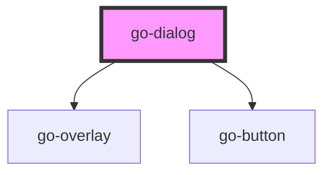

## go-dialog API

<!-- Auto Generated Below -->

## Usage

### Go-dialog

  

    <go-button block="mobile" id="btn">Show dialog</go-button>
     
    <go-button block="mobile" id="btn-persistent">Show persistent dialog</go-button>
  

  
A dialog should capture the keyboard focus.

  
A dialog should also prevent body from scrolling when active.

  
See <a href="https://www.w3.org/TR/wai-aria-practices/#dialog_modal" target="_blank" rel="nofollow noopener">WAI Design Pattern</a> for more details.

  <a href="#">Focus</a>
  <a href="#">Focus</a>
  <a href="#">Focus</a>
  <a href="#">Focus</a>
  <a href="#">Focus</a>

  

<!-- dismissible dialog -->
<go-dialog id="normal" heading="Dialog content">
  

    Lorem ipsum dolor sit amet consectetur adipisicing elit. A eos, quidem sint perferendis suscipit
    <a href="#">Focus</a>
    Lorem ipsum dolor sit amet consectetur adipisicing elit. Ea, sapiente.
    <a href="#">Trapped</a>
  

  

    <go-button id="close-btn" block="mobile">Close</go-button>
  

</go-dialog>

<!-- persistent dialog -->
<go-dialog id="persistent" persistent="true" heading="Heading">
  

    Lorem ipsum dolor sit amet consectetur adipisicing elit. A eos, quidem sint perferendis suscipit
    <a href="#">Focus</a>
    Lorem ipsum dolor sit amet consectetur adipisicing elit. Ea, sapiente.
    <a href="#">Focus Trapped</a>
  

  

    <go-button id="close-persistent-btn" block="mobile">Close</go-button>
  

</go-dialog>

## Properties

| Property     | Attribute    | Description                                                                                                 | Type                        | Default     |
| ------------ | ------------ | ----------------------------------------------------------------------------------------------------------- | --------------------------- | ----------- |
| `active`     | `active`     | If this dialog is active                                                                                    | `boolean`                   | `false`     |
| `heading`    | `heading`    | Heading of the overlay content                                                                              | `string`                    | `undefined` |
| `persistent` | `persistent` | If persistent, the overlay will not be closed when the user clicks outside of it or presses the escape key. | `boolean`                   | `false`     |
| `role`       | `role`       | Accessible role of the dialog, can be dialog or alertdialog                                                 | `"alertdialog" \| "dialog"` | `'dialog'`  |

## Methods

### `close() => Promise<void>`

#### Returns

Type: `Promise<void>`

### `open() => Promise<void>`

#### Returns

Type: `Promise<void>`

## Dependencies

### Depends on

- [go-overlay](../go-overlay)
- [go-button](../go-button)

### Graph

----------------------------------------------

