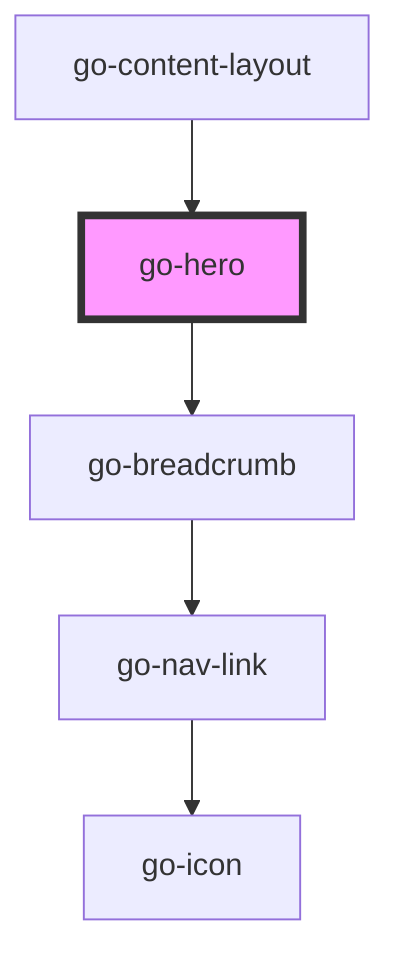

## go-hero API

<!-- Auto Generated Below -->

## Usage

### Go-hero

<go-hero
  pre-heading="Go UI"
  heading="Hero heading"
  breadcrumb="[
  {
    label: 'Home',
    url: '#'
  },
  {
    label: 'Components',
    url: '#'
  },
  {
    label: 'Hero',
    url: '#'
  }
]"
  img-src="https://images.unsplash.com/photo-1649662231372-0ca430eb5b01?ixlib=rb-1.2.1&ixid=MnwxMjA3fDB8MHxwaG90by1wYWdlfHx8fGVufDB8fHx8&auto=format&fit=crop&w=1470&q=80"
  img-alt="Beautiful mountain view"
>
  
Lorem ipsum dolor sit amet, consectetur adipisicing elit. Consequuntur ad ab nisi, temporibus veritatis voluptates eum nulla dolor quae necessitatibus

</go-hero>

## Properties

| Property     | Attribute     | Description                                                              | Type                   | Default     |
| ------------ | ------------- | ------------------------------------------------------------------------ | ---------------------- | ----------- |
| `breadcrumb` | `breadcrumb`  | Breadcrumb navigation items                                              | `INavItem[] \| string` | `undefined` |
| `heading`    | `heading`     | Hero heading (h1)                                                        | `string`               | `undefined` |
| `imgAlt`     | `img-alt`     | hero image alt text (requires img-src attribute to be present to render) | `string`               | `undefined` |
| `imgSrc`     | `img-src`     | hero image src url (requires img-alt attribute to be present to render)  | `string`               | `undefined` |
| `preHeading` | `pre-heading` | Pre heading text - use only when required                                | `string`               | `undefined` |

## Slots

| Slot        | Description                    |
| ----------- | ------------------------------ |
| `"default"` | content below the main heading |

## Dependencies

### Used by

 - [go-content-layout](../../patterns/go-content-layout)

### Depends on

- [go-breadcrumb](../go-breadcrumb)

### Graph

----------------------------------------------

