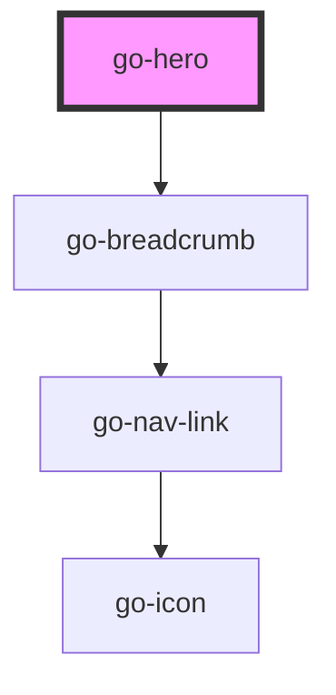

## go-hero API

<!-- Auto Generated Below -->

## Properties

| Property     | Attribute     | Description                                                              | Type                   | Default     |
| ------------ | ------------- | ------------------------------------------------------------------------ | ---------------------- | ----------- |
| `breadcrumb` | `breadcrumb`  |                                                                          | `INavItem[] \| string` | `undefined` |
| `heading`    | `heading`     |                                                                          | `string`               | `undefined` |
| `imgAlt`     | `img-alt`     | hero image alt text (requires img-src attribute to be present to render) | `string`               | `undefined` |
| `imgSrc`     | `img-src`     | hero image src url (requires img-alt attribute to be present to render)  | `string`               | `undefined` |
| `preHeading` | `pre-heading` |                                                                          | `string`               | `undefined` |

## Dependencies

### Depends on

- [go-breadcrumb](../go-breadcrumb)

### Graph

----------------------------------------------

