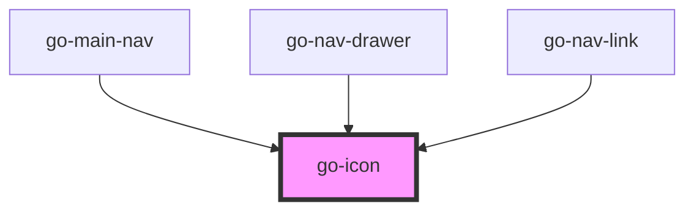

## API

<!-- Auto Generated Below -->

## Usage

### Go-icon

<!-- Include Material Icons -->
<link href="https://fonts.googleapis.com/icon?family=Material+Icons" rel="stylesheet" />

<!-- Include Font Awesome -->
<link
  rel="stylesheet"
  href="https://cdnjs.cloudflare.com/ajax/libs/font-awesome/5.15.4/css/all.min.css"
  integrity="sha512-1ycn6IcaQQ40/MKBW2W4Rhis/DbILU74C1vSrLJxCq57o941Ym01SwNsOMqvEBFlcgUa6xLiPY/NS5R+E6ztJQ=="
  crossorigin="anonymous"
  referrerpolicy="no-referrer"
/>

<!-- Include Boxicons -->
<link href="https://unpkg.com/boxicons@2.1.1/css/boxicons.min.css" rel="stylesheet" />

  <h3>
    <go-link href="https://fonts.google.com/icons">Material Icons</go-link>
  </h3>
  

    <go-icon icon-set="material-icons" name="favorite" size="3rem" color="var(--go-color-critical-500)"></go-icon>
    <go-icon icon-set="material-icons" name="home" label="Home"></go-icon>
  

  <h3>
    <go-link href="https://fontawesome.com/">Font Awesome</go-link>
  </h3>
  

    <go-icon icon-set="fas" name="heart" size="3rem" color="var(--go-color-critical-500)"></go-icon>
    <go-icon icon-set="fas" name="home" label="Home"></go-icon>
  

  <h3>
    <go-link href="https://boxicons.com/">Boxicons</go-link>
  </h3>
  

    <go-icon icon-set="bxs" name="heart" size="3rem" color="var(--go-color-critical-500)"></go-icon>
    <go-icon icon-set="bx" name="home" label="Home"></go-icon>
  

## Properties

| Property     | Attribute    | Description                                                                                                     | Type                                                                                                                                                                       | Default            |
| ------------ | ------------ | --------------------------------------------------------------------------------------------------------------- | -------------------------------------------------------------------------------------------------------------------------------------------------------------------------- | ------------------ |
| `color`      | `color`      | Color of the icon,  supports CSS units and variables. Default: `currentColor`                                   | `string`                                                                                                                                                                   | `undefined`        |
| `decorative` | `decorative` | Mark this icon to be hidden from screen reader                                                                  | `boolean`                                                                                                                                                                  | `false`            |
| `iconSet`    | `icon-set`   | Specify the icon set being referenced. Icon font CSS files must be included in the page.                        | `"bx" \| "bxl" \| "bxs" \| "fab" \| "fad" \| "fal" \| "far" \| "fas" \| "material-icons" \| "material-icons-outlined" \| "material-icons-round" \| "material-icons-sharp"` | `'material-icons'` |
| `name`       | `name`       | Name of the icon                                                                                                | `string`                                                                                                                                                                   | `undefined`        |
| `size`       | `size`       | Size of the icon, supports CSS units and variables. Default: 1.5em for material icons, 1em for other icon sets. | `string`                                                                                                                                                                   | `undefined`        |

## Dependencies

### Used by

 - [go-main-nav](../navigation/go-main-nav)
 - [go-nav-drawer](../navigation/go-nav-drawer)
 - [go-nav-link](../navigation/go-nav-link)

### Graph

----------------------------------------------

*Built with [StencilJS](https://stenciljs.com/)*
