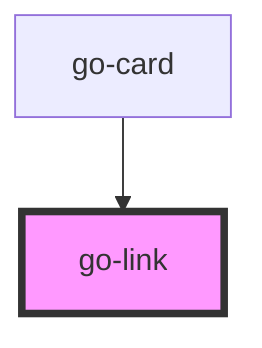

## go-link API

<!-- Auto Generated Below -->

## Usage

### Go-link

<demo-playground
  tag="go-link"
  props="[
    {name: 'href', value:'#', type: 'string'},
    {name: 'target', value: null, type: 'select', options: ['_self','_blank']}
  ]"
>
  <go-link href="#">Almost before we knew it, we had left the ground.</go-link>
</demo-playground>

## Properties

| Property              | Attribute               | Description               | Type                                         | Default     |
| --------------------- | ----------------------- | ------------------------- | -------------------------------------------- | ----------- |
| `expandClickableArea` | `expand-clickable-area` |                           | `boolean`                                    | `false`     |
| `href`                | `href`                  | The `href` of the link.   | `string`                                     | `undefined` |
| `target`              | `target`                | The `target` of the link. | `"_blank" \| "_parent" \| "_self" \| "_top"` | `undefined` |

## Dependencies

### Used by

 - [go-card](../go-card)

### Graph

----------------------------------------------

