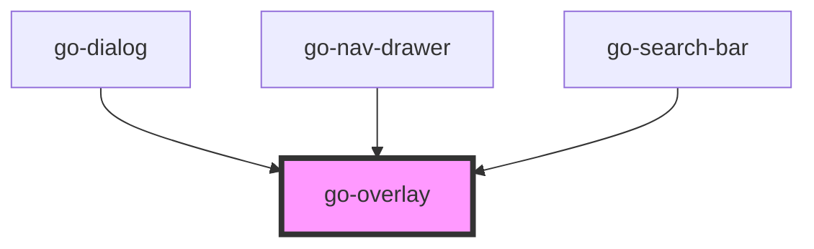

## go-overlay API

<!-- Auto Generated Below -->

## Usage

### Go-overlay

<go-overlay id="overlay">
  

    

      <a href="#123">123</a>
      <go-button variant="primary" id="close-btn" block="mobile">Close overlay (via method)</go-button>
      <go-button variant="primary" id="close-btn-attr" block="mobile">Close overlay (via updating attribute)</go-button>
    

  

</go-overlay>

  

    

      <go-button id="btn">Show overlay</go-button>
    

    
Overlay should capture the keyboard focus.

    
Overlay should also prevent body from scrolling when active.

    
See <a href="https://www.w3.org/TR/wai-aria-practices/#dialog_modal" target="_blank" rel="nofollow noopener">WAI Design Pattern</a> for more details.

    <a href="#">Focus</a>
    <a href="#">Focus</a>
    <a href="#">Focus</a>
    <a href="#">Focus</a>
    <a href="#">Focus</a>

    

  

## Properties

| Property     | Attribute    | Description                                                                                                 | Type      | Default |
| ------------ | ------------ | ----------------------------------------------------------------------------------------------------------- | --------- | ------- |
| `active`     | `active`     |                                                                                                             | `boolean` | `false` |
| `persistent` | `persistent` | If persistent, the overlay will not be closed when the user clicks outside of it or presses the escape key. | `boolean` | `false` |

## Events

| Event          | Description                        | Type                |
| -------------- | ---------------------------------- | ------------------- |
| `overlayClose` | Emitted when the overlay is closed | `CustomEvent<void>` |
| `overlayOpen`  | Emitted when the overlay is opened | `CustomEvent<void>` |

## Methods

### `close() => Promise<void>`

#### Returns

Type: `Promise<void>`

### `open() => Promise<void>`

#### Returns

Type: `Promise<void>`

## Dependencies

### Used by

 - [go-dialog](../go-dialog)
 - [go-nav-drawer](../navigation/go-nav-drawer)
 - [go-search-bar](../go-search-bar)

### Graph

----------------------------------------------

*Built with [StencilJS](https://stenciljs.com/)*
