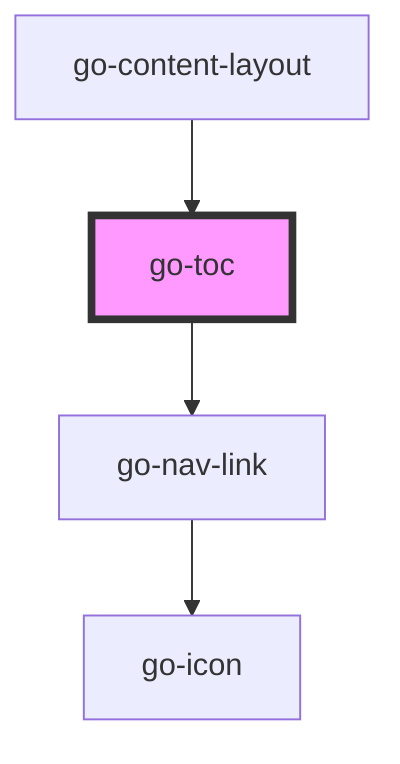

## go-toc API

<!-- Auto Generated Below -->

## Properties

| Property   | Attribute  | Description                             | Type     | Default          |
| ---------- | ---------- | --------------------------------------- | -------- | ---------------- |
| `label`    | `label`    | Label for the TOC                       | `string` | `'On this page'` |
| `scope`    | `scope`    | Specify the scope to get TOC items from | `string` | `'main'`         |
| `selector` | `selector` | Selector for the TOC items              | `string` | `'h2'`           |

## Methods

### `init() => Promise<void>`

Query the DOM and generate TOC
If content in scope is dynamically loaded, it may not be available when this toc component loads.
call this `init` method and have the toc regenerate the links

#### Returns

Type: `Promise<void>`

void

## Dependencies

### Used by

 - [go-content-layout](../../patterns/go-content-layout)

### Depends on

- [go-nav-link](../navigation/go-nav-link)

### Graph

----------------------------------------------

