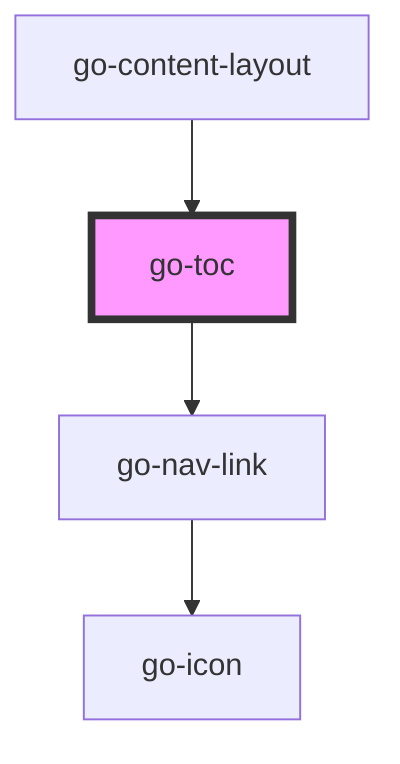

## go-toc API

<!-- Auto Generated Below -->

## Usage

### Go-toc

<main class="container">
  <go-toc></go-toc>

  <h1>h1 HTML5 Kitchen Sink</h1>
  <h2>h2 Back in my quaint <a href="#">garden</a></h2>
  <h3>h3 Jaunty <a href="#">zinnias</a> vie with flaunting phlox</h3>
  <h4>h4 Five or six big jet planes zoomed quickly by the new tower.</h4>
  

    Lorem ipsum dolor sit, amet consectetur adipisicing elit. Id facere a perspiciatis rerum culpa repellendus dolorum tempora vero, dolor magnam deserunt! Quia
    deleniti nemo repellat consectetur accusamus ab necessitatibus perferendis.
  

  <ul>
    <li><a href="#">Home</a></li>
    <li><a href="#">About</a></li>
    <li><a href="#">Contact</a></li>
  </ul>
  

    Lorem ipsum dolor sit, amet consectetur adipisicing elit. Id facere a perspiciatis rerum culpa repellendus dolorum tempora vero, dolor magnam deserunt! Quia
    deleniti nemo repellat consectetur accusamus ab necessitatibus perferendis.
  

  <h2>Cumque, ducimus libero.</h2>
  

    Lorem ipsum dolor sit amet consectetur, adipisicing elit. Pariatur iste eligendi laboriosam porro dolorum temporibus nesciunt quidem, cumque soluta nobis
    commodi vitae eveniet, earum voluptas ullam perspiciatis id adipisci cum!
  

  <h2>Modi, ullam rerum?</h2>
  
Lorem ipsum dolor sit amet.

  <h3>h3. Lorem ipsum dolor sit.</h3>
  
Lorem ipsum dolor sit.

  <h3>h3. Lorem ipsum dolor sit.</h3>
  
Lorem ipsum dolor sit.

  <h2>Soluta, vero error!</h2>
  

    Lorem ipsum, dolor sit amet consectetur adipisicing elit. Explicabo non iste nemo similique aut. Fugit perferendis reiciendis dolores numquam adipisci
    possimus consequatur obcaecati at est ipsam autem, consectetur, suscipit soluta.
  

</main>

## Properties

| Property   | Attribute  | Description                             | Type     | Default          |
| ---------- | ---------- | --------------------------------------- | -------- | ---------------- |
| `label`    | `label`    | Label for the TOC                       | `string` | `'On this page'` |
| `scope`    | `scope`    | Specify the scope to get TOC items from | `string` | `'main'`         |
| `selector` | `selector` | Selector for the TOC items              | `string` | `'h2'`           |

## Methods

### `init() => Promise<void>`

Query the DOM and generate TOC
If content in scope is dynamically loaded, it may not be available when this toc component loads.
call this `init` method and have the toc regenerate the links

#### Returns

Type: `Promise<void>`

void

## Dependencies

### Used by

 - [go-content-layout](../../patterns/go-content-layout)

### Depends on

- [go-nav-link](../navigation/go-nav-link)

### Graph

----------------------------------------------

