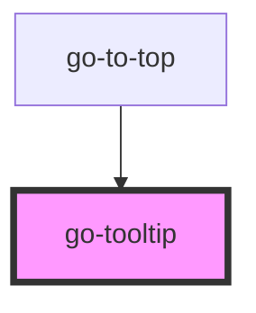

## go-tooltip API

<!-- Auto Generated Below -->

## Usage

### Go-tooltip

<link rel="stylesheet" href="https://fonts.googleapis.com/icon?family=Material+Icons" />

  
Scrollable area

  

    

      <section>
        <h2>Basic tooltip</h2>
        <go-button variant="primary" id="tooltip-trigger" type="button">Hover me</go-button>
      </section>
      <section>
        <h2>Arrow tooltip</h2>
        <go-button variant="primary" id="arrow-trigger" type="button" icon="true" round="true" aria-label="Help button">
          <go-icon name="live_help"></go-icon>
        </go-button>
      </section>
      <section>
        <h2>Inline tooltip</h2>
        

          Lorem ipsum dolor sit amet consectetur adipisicing elit. <a href="#" id="inline-trigger">Eius aliquam cumqu minus iste tempora quo fuga laborume</a>
          placeat consectetur enim consequuntur veniam. Dicta cumque minima ipsam, quae temporibus quidem esse. Lorem ipsum dolor sit amet consectetur
          adipisicing elit. Recusandae ipsa nobis nemo maxime deleniti soluta et odit, maiores accusamus fugiat totam consequatur illum impedit architecto ea,
          iste nostrum, quaerat cumque?
        

      </section>
      <section>
        <h2>Placement</h2>
        <go-button variant="primary" id="placement-trigger" type="button">Hover me</go-button>
      </section>
    

  

  <go-tooltip trigger-id="tooltip-trigger">Lorem ipsum dolor sit amet consectetur adipisicing </go-tooltip>
  <go-tooltip inline="true" trigger-id="inline-trigger">Hello world</go-tooltip>
  <go-tooltip inline="true" arrow="true" trigger-id="arrow-trigger">Hello world</go-tooltip>
  <go-tooltip arrow="true" trigger-id="placement-trigger">Top (default)</go-tooltip>
  <go-tooltip placement="bottom" arrow="true" trigger-id="placement-trigger">Bottom</go-tooltip>
  <go-tooltip placement="left" arrow="true" trigger-id="placement-trigger">Left</go-tooltip>
  <go-tooltip placement="right" arrow="true" trigger-id="placement-trigger">Right</go-tooltip>

## Properties

| Property    | Attribute    | Description                                                                                                                   | Type                                     | Default     |
| ----------- | ------------ | ----------------------------------------------------------------------------------------------------------------------------- | ---------------------------------------- | ----------- |
| `arrow`     | `arrow`      | Add arrow to the tooltip                                                                                                      | `boolean`                                | `false`     |
| `inline`    | `inline`     | Improve positioning for inline trigger elements that span over multiple lines. Reference: https://floating-ui.com/docs/inline | `boolean`                                | `false`     |
| `placement` | `placement`  | placement of tooltip relative to the trigger element                                                                          | `"bottom" \| "left" \| "right" \| "top"` | `'top'`     |
| `triggerId` | `trigger-id` | Query selector string for the element inside the slot that triggers the tooltip.                                              | `string`                                 | `undefined` |

## CSS Custom Properties

| Name                 | Description                                                             |
| -------------------- | ----------------------------------------------------------------------- |
| `--tooltip-bg-color` | Background color of the tooltip. - default: var(--go-color-primary-800) |
| `--tooltip-fg-color` | Text color of the tooltip. - default: var(--go-color-lightest)          |
| `--tooltip-padding`  | Padding around tooltip - default: 0.5rem                                |
| `--tooltip-radius`   | Border radius of tooltip - default: var(--radius-2)                     |

## Dependencies

### Used by

 - [go-to-top](../go-to-top)

### Graph

----------------------------------------------

*Built with [StencilJS](https://stenciljs.com/)*
