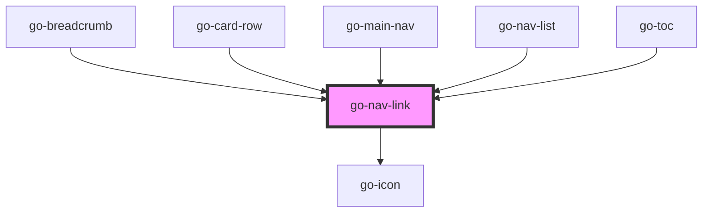

## go-nav-link API

<!-- Auto Generated Below -->

## Usage

### Go-nav-link

<link href="https://unpkg.com/boxicons@2.1.1/css/boxicons.min.css" rel="stylesheet" />
<demo-playground
  tag="go-nav-link"
  props="[
  {
    name: 'item',
    type: 'object',
    value: {
      label: 'Link',
      url: '#',
      icon: {
        iconSet: 'bx',
        name: 'star',
        size: '1.5em'
      },
      linkAttrs: {
        title: 'Link title text'
      },
    },
  },
  {name: 'showArrow', type: 'boolean', value: false},
]"
>
  <go-nav-link></go-nav-link>
</demo-playground>

## Properties

| Property    | Attribute    | Description                       | Type       | Default     |
| ----------- | ------------ | --------------------------------- | ---------- | ----------- |
| `block`     | `block`      | full width                        | `boolean`  | `false`     |
| `item`      | --           | navigation item                   | `INavItem` | `undefined` |
| `showArrow` | `show-arrow` | show arrow at the end of the link | `boolean`  | `false`     |

## Events

| Event      | Description | Type               |
| ---------- | ----------- | ------------------ |
| `navigate` |             | `CustomEvent<any>` |

## Dependencies

### Used by

 - [go-breadcrumb](../../go-breadcrumb)
 - [go-card-row](../../../patterns/go-card-row)
 - [go-main-nav](../go-main-nav)
 - [go-nav-list](../go-nav-list)
 - [go-toc](../../go-toc)

### Depends on

- [go-icon](../../go-icon)

### Graph

----------------------------------------------

*Built with [StencilJS](https://stenciljs.com/)*
