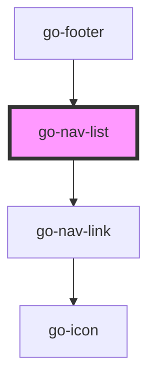

## go-nav-list API

<!-- Auto Generated Below -->

## Usage

### Go-nav-list

<link rel="stylesheet" href="https://fonts.googleapis.com/icon?family=Material+Icons" />

  <h3>List with heading link</h3>
  <go-nav-list
    heading-item="{
    label: 'List heading',
  }"
    items="[
          {
            label: 'Dashboard',
            url: '#',
            icon: 'dashboard',
          },
          {
            label: 'Forms',
            url: '#',
            icon: 'text_fields',
          },
          {
            label: 'Tables',
            url: '#',
            icon: 'grid_on',
          },
          {
            label: 'Charts',
            url: '#',
            icon: 'insert_chart',
          },
          {
            label: 'User profile',
            url: '#',
            icon: 'person',
          },
        ]"
  ></go-nav-list>

### Go-nav-list-js

<link rel="stylesheet" href="https://fonts.googleapis.com/icon?family=Material+Icons" />

  <h3>List with heading text</h3>
  <go-nav-list class="js-items" heading="List heading"></go-nav-list>
  <h3>List with custom heading slot</h3>
  <go-nav-list class="js-items">
    <h2 slot="heading">List heading</h2>
  </go-nav-list>
  <h3>No heading</h3>
  <go-nav-list class="js-items"></go-nav-list>
  <h3>Full width list</h3>
  <go-nav-list class="js-items js-heading-item" block></go-nav-list>

## Properties

| Property      | Attribute      | Description                              | Type                   | Default     |
| ------------- | -------------- | ---------------------------------------- | ---------------------- | ----------- |
| `block`       | `block`        | Make the list full width                 | `boolean`              | `false`     |
| `heading`     | `heading`      | Heading text                             | `string`               | `undefined` |
| `headingItem` | `heading-item` | Heading navigation item                  | `INavItem \| string`   | `undefined` |
| `items`       | `items`        | list of navigation items to be displayed | `INavItem[] \| string` | `undefined` |

## Dependencies

### Used by

 - [go-footer](../../../patterns/footer)

### Depends on

- [go-nav-link](../go-nav-link)

### Graph

----------------------------------------------

