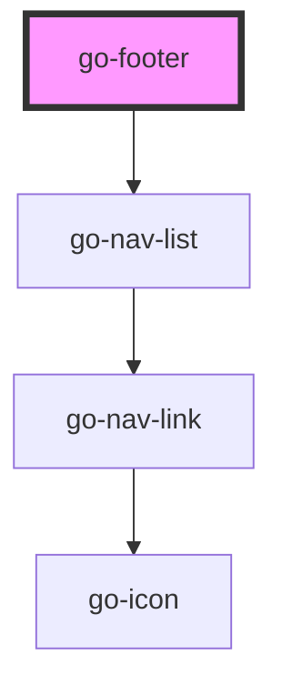

## footer API

<!-- Auto Generated Below -->

## Properties

| Property         | Attribute          | Description                                     | Type                   | Default               |
| ---------------- | ------------------ | ----------------------------------------------- | ---------------------- | --------------------- |
| `dark`           | `dark`             | Dark theme footer                               | `boolean`              | `false`               |
| `links`          | `links`            | Navigation links to be displayed.               | `INavItem[] \| string` | `undefined`           |
| `navCols`        | `nav-cols`         | Number of navigation columns                    | `number`               | `1`                   |
| `navColsDesktop` | `nav-cols-desktop` | Number of navigation columns for desktop and up | `number`               | `4`                   |
| `navColsTablet`  | `nav-cols-tablet`  | Number of navigation columns for tablet and up  | `number`               | `3`                   |
| `navLabel`       | `nav-label`        | Label for navigation                            | `string`               | `'Footer navigation'` |

## Dependencies

### Depends on

- [go-nav-list](../../components/navigation/go-nav-list)

### Graph

----------------------------------------------

