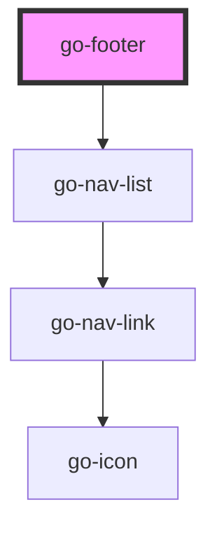

## footer API

<!-- Auto Generated Below -->

## Usage

### Custom

<go-footer>
  

    

      

        

          
        

        <h3>hello world</h3>
      

      

        <ul>
          <li>
            <a href="#">Privacy policies</a>
          </li>
          <li>
            <a href="#">Terms and conditions</a>
          </li>
          <li>
            <a href="#">Contact</a>
          </li>
        </ul>
      

    

  

  

    Lorem ipsum dolor sit amet, consectetur adipisicing elit. Sapiente sed dolorum nemo facere neque eveniet modi accusantium fuga placeat expedita. Eius minus
    non vero id neque. Id a expedita atque.
  

</go-footer>

### Dark

<!-- material icons -->
<link rel="stylesheet" href="https://fonts.googleapis.com/icon?family=Material+Icons" />
<go-footer
  dark
  links="[
{
label: 'Features',
url: '#',
icon: 'star',
children: [
  {
    label: 'Home',
    url: '#',
    icon: 'home'
  },
  {
    label: 'About',
    url: '#',
    icon: 'info'
  },
  {
    label: 'Contact',
    url: '#',
    icon: 'contact_mail'
  }
]
},
{
label: 'Get involved',
url: '#',
children: [
  {
    label: 'Bug report',
    url: '#',
  },
  {
    label: 'Feature request',
    url: '#',
  },
  {
    label: 'Development guide',
    url: '#',
  },
],
},
{
label: 'Community',
icon: 'people',
children: [
  {
    label: 'Discord',
    url: 'https://discord.gg/g7cuQAdPfS',
    linkAttr: {
      target: '_blank',
      rel: 'noopener noreferrer'
    }
  },
  {
    label: 'Twitter',
    url: 'https://twitter.com/go-components',
    linkAttr: {
      target: '_blank',
      rel: 'noopener noreferrer'
    }
  },
],
},
]"
>
  

    Lorem ipsum dolor sit amet, consectetur adipisicing elit. Sapiente sed dolorum nemo facere neque eveniet modi accusantium fuga placeat expedita. Eius minus
    non vero id neque. Id a expedita atque.
  

  

    
    <ul class="link-list">
      <li>
        <a href="#">Privacy policies</a>
      </li>
      <li>
        <a href="#">Terms and conditions</a>
      </li>
      <li>
        <a href="#">Contact</a>
      </li>
    </ul>
  

</go-footer>

### Footer

<!-- material icons -->
<link rel="stylesheet" href="https://fonts.googleapis.com/icon?family=Material+Icons" />
<go-footer
  links="[
{
  label: 'Features',
  icon: 'star',
  children: [
    {
      label: 'Home',
      url: '#',
      icon: 'home'
    },
    {
      label: 'About',
      url: '#',
      icon: 'info'
    },
    {
      label: 'Contact',
      url: '#',
      icon: 'contact_mail'
    }
  ]
},
{
  label: 'Get involved',
  url: '#',
  children: [
    {
      label: 'Bug report',
      url: '#',
    },
    {
      label: 'Feature request',
      url: '#',
    },
    {
      label: 'Development guide',
      url: '#',
    },
  ],
},
{
  label: 'Community',
  icon: 'people',
  children: [
    {
      label: 'Discord',
      url: 'https://discord.gg/g7cuQAdPfS',
      linkAttr: {
        target: '_blank',
        rel: 'noopener noreferrer'
      }
    },
    {
      label: 'Twitter',
      url: 'https://twitter.com/go-components',
      linkAttr: {
        target: '_blank',
        rel: 'noopener noreferrer'
      }
    },
  ],
},
]"
>
  

    Lorem ipsum dolor sit amet, consectetur adipisicing elit. Sapiente sed dolorum nemo facere neque eveniet modi accusantium fuga placeat expedita. Eius minus
    non vero id neque. Id a expedita atque.
  

  

    
    <ul class="link-list">
      <li>
        <a href="#">Privacy policies</a>
      </li>
      <li>
        <a href="#">Terms and conditions</a>
      </li>
      <li>
        <a href="#">Contact</a>
      </li>
    </ul>
  

</go-footer>

## Properties

| Property         | Attribute          | Description                                     | Type                   | Default               |
| ---------------- | ------------------ | ----------------------------------------------- | ---------------------- | --------------------- |
| `dark`           | `dark`             | Dark theme footer                               | `boolean`              | `false`               |
| `links`          | `links`            | Navigation links to be displayed.               | `INavItem[] \| string` | `undefined`           |
| `navCols`        | `nav-cols`         | Number of navigation columns                    | `number`               | `1`                   |
| `navColsDesktop` | `nav-cols-desktop` | Number of navigation columns for desktop and up | `number`               | `4`                   |
| `navColsTablet`  | `nav-cols-tablet`  | Number of navigation columns for tablet and up  | `number`               | `3`                   |
| `navLabel`       | `nav-label`        | Label for navigation                            | `string`               | `'Footer navigation'` |

## Dependencies

### Depends on

- [go-nav-list](../../components/navigation/go-nav-list)

### Graph

----------------------------------------------

