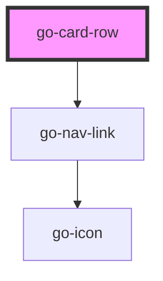

## go-card-row API

<!-- Auto Generated Below -->

## Usage

### Go-card-row

  <go-card-row heading="Dog quotes" more-link-href="#" more-link-text="More quotes">
    <go-card href="#" card-title="Dog quote" card-subtitle="Subtitle">
      
      Everything I know I learned from dogs
      <em slot="footer">Nora Roberts (author, The Search)</em>
    </go-card>
    <go-card href="#" card-title="Dog quote" card-subtitle="Subtitle">
      
      Dogs do speak, but only to those who know how to listen
      <em slot="footer">Orhan Pamuk (author, My Name Is Red)</em>
    </go-card>
    <go-card href="#" card-title="Dog quote" card-subtitle="Subtitle">
      
      The better I get to know men, the more I find myself loving dogs
      <em slot="footer">Charles De Gaulle</em>
    </go-card>
    <go-card href="#" card-title="Dog quote" card-subtitle="Subtitle">
      
      Everything I know I learned from dogs
      <em slot="footer">Nora Roberts (author, The Search)</em>
    </go-card>
    <go-card href="#" card-title="Dog quote" card-subtitle="Subtitle">
      
      Dogs do speak, but only to those who know how to listen
      <em slot="footer">Orhan Pamuk (author, My Name Is Red)</em>
    </go-card>
    <go-card href="#" card-title="Dog quote" card-subtitle="Subtitle">
      
      The better I get to know men, the more I find myself loving dogs
      <em slot="footer">Charles De Gaulle</em>
    </go-card>
  </go-card-row>

### Go-card-row-dynamic

## Properties

| Property       | Attribute        | Description                                                                                                                                                                                                                                        | Type      | Default     |
| -------------- | ---------------- | -------------------------------------------------------------------------------------------------------------------------------------------------------------------------------------------------------------------------------------------------- | --------- | ----------- |
| `cols`         | `cols`           | Number of columns from mobile breakpoint and up                                                                                                                                                                                                    | `number`  | `1`         |
| `colsDesktop`  | `cols-desktop`   | Number of columns from desktop breakpoint and up                                                                                                                                                                                                   | `number`  | `3`         |
| `colsLarge`    | `cols-large`     | Number of columns from large breakpoint and up                                                                                                                                                                                                     | `number`  | `4`         |
| `colsTablet`   | `cols-tablet`    | Number of columns from tablet breakpoint and up                                                                                                                                                                                                    | `number`  | `2`         |
| `heading`      | `heading`        | Heading for this card row section                                                                                                                                                                                                                  | `string`  | `undefined` |
| `moreLinkHref` | `more-link-href` | View more link href                                                                                                                                                                                                                                | `string`  | `undefined` |
| `moreLinkText` | `more-link-text` | View more link text                                                                                                                                                                                                                                | `string`  | `undefined` |
| `noStretch`    | `no-stretch`     | By default, `go-card-row` stretches all cards inside to the tallest card in view, unless this property is set to true.                                                                                                                             | `boolean` | `false`     |
| `stagger`      | `stagger`        | If set, cards will fade in one by one with the specified delay in milliseconds when they are in the viewport. uses `IntersectionObserver`, [see browser compatibility](https://developer.mozilla.org/en-US/docs/Web/API/Intersection_Observer_API) | `number`  | `undefined` |

## Slots

| Slot        | Description                                              |
| ----------- | -------------------------------------------------------- |
| `"default"` | Default slot, to be filled with `go-card` elements       |
| `"heading"` | Overwrite default `h2` heading for this card row section |

## Dependencies

### Depends on

- [go-nav-link](../../components/navigation/go-nav-link)

### Graph

----------------------------------------------

*Built with [StencilJS](https://stenciljs.com/)*
