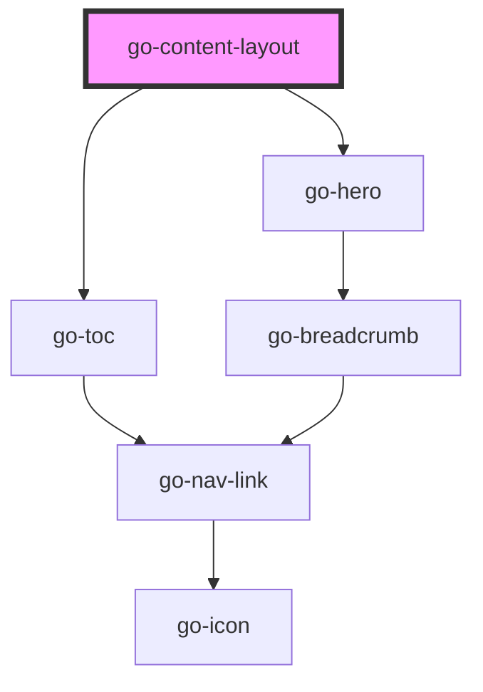

## go-content-layout API

<!-- Auto Generated Below -->

## Properties

| Property                 | Attribute                  | Description | Type                   | Default     |
| ------------------------ | -------------------------- | ----------- | ---------------------- | ----------- |
| `breadcrumbs`            | `breadcrumbs`              |             | `INavItem[] \| string` | `undefined` |
| `heroImgAlt`             | `hero-img-alt`             |             | `string`               | `undefined` |
| `heroImgSrc`             | `hero-img-src`             |             | `string`               | `undefined` |
| `intro`                  | `intro`                    |             | `string`               | `undefined` |
| `pageHeading`            | `page-heading`             |             | `string`               | `undefined` |
| `preHeading`             | `pre-heading`              |             | `string`               | `undefined` |
| `sidebarDesktopPosition` | `sidebar-desktop-position` |             | `"end" \| "start"`     | `'start'`   |
| `sidebarMobilePosition`  | `sidebar-mobile-position`  |             | `"end" \| "start"`     | `'start'`   |
| `sidebarSticky`          | `sidebar-sticky`           |             | `boolean`              | `false`     |
| `toc`                    | `toc`                      |             | `boolean`              | `undefined` |
| `tocProps`               | --                         |             | `TocProps`             | `undefined` |

## Methods

### `initToc() => Promise<void>`

#### Returns

Type: `Promise<void>`

## Slots

| Slot      | Description             |
| --------- | ----------------------- |
| `"intro"` | Hero section intro text |
| `"main"`  | Main section            |

## Dependencies

### Depends on

- [go-toc](../../components/go-toc)
- [go-hero](../../components/go-hero)

### Graph

----------------------------------------------

