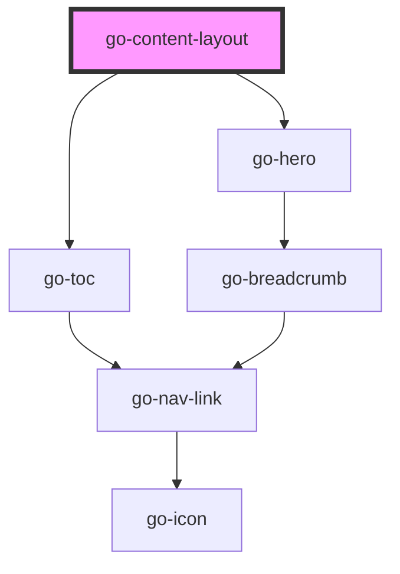

## go-content-layout API

<!-- Auto Generated Below -->

## Usage

### Go-content-layout

<go-content-layout
  breadcrumbs="[
 {
   label: 'Home',
   url: '#',
 },
 {
   label: 'Top level content page',
   url: '#',
 },
 {
   label: 'Parent page',
   url: '#',
 }
 ]"
  pre-heading="Content template"
  page-heading="Example page"
  intro="This page's layout is managed by go-content-layout, the content below comes from the readme markdown file of this project."
  id="layout">
  <go-md id="main" sanitise="true" md-options="{html: true}" src="//raw.githubusercontent.com/getgoui/go-ui/main/README.md">
    

      Sorry the content of this page couldn't be loaded,
      <a href="//raw.githubusercontent.com/getgoui/go-ui/main/README.md" target="_blank">see the source here</a>.
    

  </go-md>
</go-content-layout>

### Sidebar

<go-content-layout
  breadcrumbs="[
 {
   label: 'Home',
   url: '#',
 },
 {
   label: 'Top level content page',
   url: '#',
 },
 {
   label: 'Parent page',
   url: '#',
 }
 ]"
  pre-heading="Content template"
  page-heading="Example page"
  intro="This page's layout is managed by go-content-layout, the content below comes from the readme markdown file of this project."
  toc
  id="layout"
  sidebar-sticky
  sidebar-mobile-position="start"
  sidebar-desktop-position="end">
  <go-md id="main" sanitise="true" md-options="{html: true}" src="//raw.githubusercontent.com/getgoui/go-ui/main/README.md">
    

      Sorry the content of this page couldn't be loaded,
      <a href="//raw.githubusercontent.com/getgoui/go-ui/main/README.md" target="_blank">see the source here</a>.
    

  </go-md>

  

    <go-card card-title="Sidebar card" card-subtitle="Subtitle">
      Lorem ipsum dolor, sit amet consectetur adipisicing elit. Atque natus autem veritatis architecto facilis

      

        <go-button variant="primary">Button</go-button>
      

      
      
Active 2 hours ago

    </go-card>
  

</go-content-layout>

### Toc

<go-content-layout
  breadcrumbs="[
 {
   label: 'Home',
   url: '#',
 },
 {
   label: 'Top level content page',
   url: '#',
 },
 {
   label: 'Parent page',
   url: '#',
 }
 ]"
  pre-heading="Content template"
  page-heading="Example page"
  intro="This page's layout is managed by go-content-layout, the content below comes from the readme markdown file of this project."
  toc
  id="layout">
  <go-md id="main" sanitise="true" md-options="{html: true}" src="//raw.githubusercontent.com/getgoui/go-ui/main/README.md">
    

      Sorry the content of this page couldn't be loaded,
      <a href="//raw.githubusercontent.com/getgoui/go-ui/main/README.md" target="_blank">see the source here</a>.
    

  </go-md>
</go-content-layout>

## Properties

| Property                 | Attribute                  | Description | Type                   | Default     |
| ------------------------ | -------------------------- | ----------- | ---------------------- | ----------- |
| `breadcrumbs`            | `breadcrumbs`              |             | `INavItem[] \| string` | `undefined` |
| `heroImgAlt`             | `hero-img-alt`             |             | `string`               | `undefined` |
| `heroImgSrc`             | `hero-img-src`             |             | `string`               | `undefined` |
| `intro`                  | `intro`                    |             | `string`               | `undefined` |
| `pageHeading`            | `page-heading`             |             | `string`               | `undefined` |
| `preHeading`             | `pre-heading`              |             | `string`               | `undefined` |
| `sidebarDesktopPosition` | `sidebar-desktop-position` |             | `"end" \| "start"`     | `'start'`   |
| `sidebarMobilePosition`  | `sidebar-mobile-position`  |             | `"end" \| "start"`     | `'start'`   |
| `sidebarSticky`          | `sidebar-sticky`           |             | `boolean`              | `false`     |
| `toc`                    | `toc`                      |             | `boolean`              | `undefined` |
| `tocProps`               | --                         |             | `TocProps`             | `undefined` |

## Methods

### `initToc() => Promise<void>`

#### Returns

Type: `Promise<void>`

## Slots

| Slot      | Description             |
| --------- | ----------------------- |
| `"intro"` | Hero section intro text |
| `"main"`  | Main section            |

## Dependencies

### Depends on

- [go-toc](../../components/go-toc)
- [go-hero](../../components/go-hero)

### Graph

----------------------------------------------

