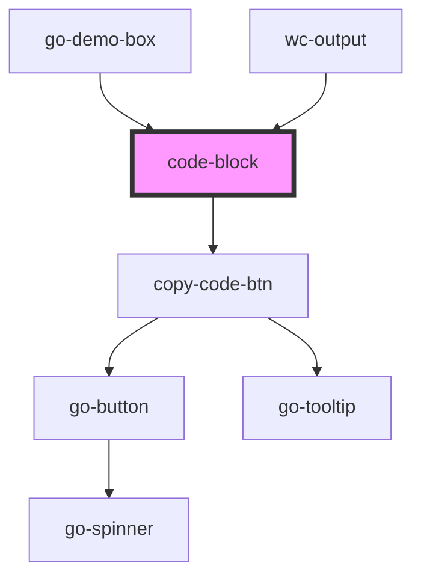

# code-block

<!-- Auto Generated Below -->

## Properties

| Property   | Attribute  | Description | Type     | Default  |
| ---------- | ---------- | ----------- | -------- | -------- |
| `code`     | `code`     |             | `string` | `''`     |
| `language` | `language` |             | `string` | `'html'` |

## Dependencies

### Used by

 - [go-demo-box](../go-demo-box)
 - [wc-output](../demo-playground)

### Depends on

- [copy-code-btn](../copy-code-btn)

### Graph

----------------------------------------------

*Built with [StencilJS](https://stenciljs.com/)*
