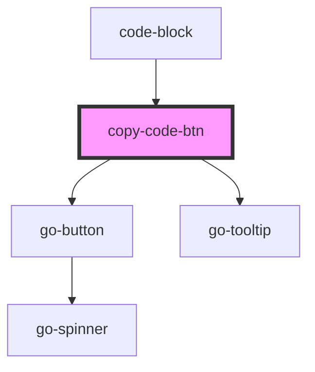

# copy-code-btn

<!-- Auto Generated Below -->

## Properties

| Property | Attribute | Description | Type     | Default |
| -------- | --------- | ----------- | -------- | ------- |
| `code`   | `code`    |             | `string` | `''`    |

## Events

| Event      | Description | Type               |
| ---------- | ----------- | ------------------ |
| `copyCode` |             | `CustomEvent<any>` |

## Dependencies

### Used by

 - [code-block](../code-block)

### Depends on

- go-button
- go-tooltip

### Graph

----------------------------------------------

*Built with [StencilJS](https://stenciljs.com/)*
