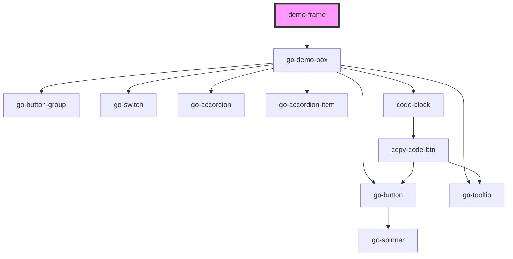

# demo-frame

<!-- Auto Generated Below -->

## Properties

| Property     | Attribute     | Description                                | Type      | Default     |
| ------------ | ------------- | ------------------------------------------ | --------- | ----------- |
| `code`       | `code`        | custom code to be injected into demo frame | `string`  | `undefined` |
| `component`  | `component`   |                                            | `string`  | `undefined` |
| `demo`       | `demo`        |                                            | `string`  | `undefined` |
| `hideSource` | `hide-source` |                                            | `boolean` | `false`     |

## Dependencies

### Depends on

- [go-demo-box](../go-demo-box)

### Graph

----------------------------------------------

*Built with [StencilJS](https://stenciljs.com/)*
