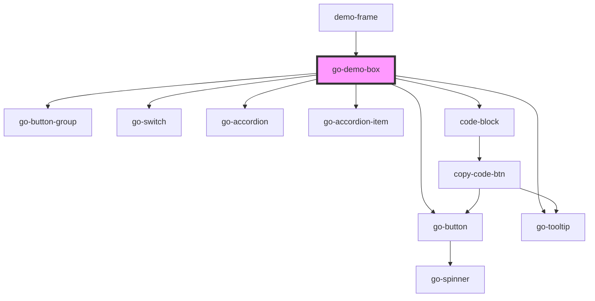

# go-demo-box

<!-- Auto Generated Below -->

## Properties

| Property         | Attribute          | Description                                | Type      | Default     |
| ---------------- | ------------------ | ------------------------------------------ | --------- | ----------- |
| `code`           | `code`             | custom code to be injected into demo frame | `string`  | `undefined` |
| `darkModeSwitch` | `dark-mode-switch` |                                            | `boolean` | `false`     |
| `disableResizeX` | `disable-resize-x` |                                            | `boolean` | `false`     |
| `disableResizeY` | `disable-resize-y` |                                            | `boolean` | `false`     |
| `head`           | `head`             | Custom head html inside iframe             | `string`  | `''`        |
| `hideControlBar` | `hide-control-bar` |                                            | `boolean` | `false`     |
| `hideSource`     | `hide-source`      |                                            | `boolean` | `false`     |

## Methods

### `reload() => Promise<void>`

#### Returns

Type: `Promise<void>`

### `setContent(code: string) => Promise<void>`

#### Parameters

| Name   | Type     | Description |
| ------ | -------- | ----------- |
| `code` | `string` |             |

#### Returns

Type: `Promise<void>`

## Dependencies

### Used by

 - [demo-frame](../demo-frame)

### Depends on

- go-button-group
- go-button
- go-tooltip
- go-switch
- go-accordion
- go-accordion-item
- [code-block](../code-block)

### Graph

----------------------------------------------

*Built with [StencilJS](https://stenciljs.com/)*
