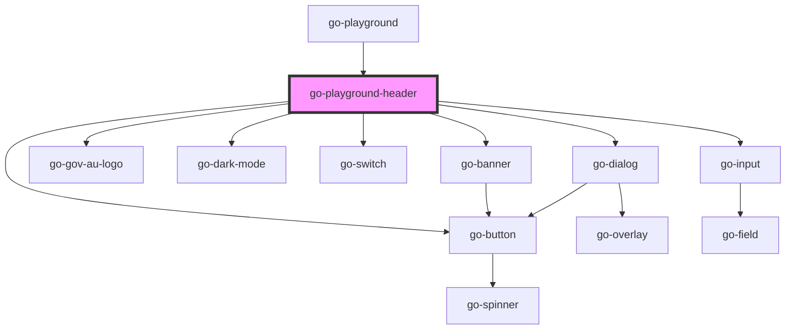

# go-playground-header

<!-- Auto Generated Below -->

## Properties

| Property  | Attribute  | Description | Type  | Default     |
| --------- | ---------- | ----------- | ----- | ----------- |
| `logoSrc` | `logo-src` |             | `any` | `undefined` |

## Events

| Event            | Description | Type               |
| ---------------- | ----------- | ------------------ |
| `darkModeChange` |             | `CustomEvent<any>` |

## Dependencies

### Used by

 - [go-playground](.)

### Depends on

- go-banner
- go-gov-au-logo
- go-dark-mode
- go-switch
- go-button
- go-dialog
- go-input

### Graph

----------------------------------------------

*Built with [StencilJS](https://stenciljs.com/)*
