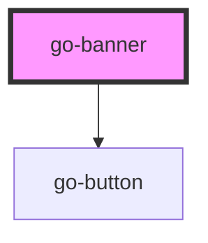

## go-banner API

<!-- Auto Generated Below -->

## Properties

| Property      | Attribute     | Description                                                     | Type                                | Default     |
| ------------- | ------------- | --------------------------------------------------------------- | ----------------------------------- | ----------- |
| `dismissible` | `dismissible` | If the banner can be dismissed, a close button will be rendered | `boolean`                           | `false`     |
| `heading`     | `heading`     | Heading of banner                                               | `string`                            | `undefined` |
| `variant`     | `variant`     | Type of banner                                                  | `"critical" \| "info" \| "success"` | `'info'`    |

## Events

| Event       | Description | Type                |
| ----------- | ----------- | ------------------- |
| `dismissed` |             | `CustomEvent<void>` |

## CSS Custom Properties

| Name                                                                                | Description                                                                                   |
| ----------------------------------------------------------------------------------- | --------------------------------------------------------------------------------------------- |
| `--banner-bg-color`                                                                 | Background color for banner. @default: inherit                                                |
| `--banner-border-color`                                                             | Define the border color for left decorative banner bar. @default: var(--go-color-primary-200) |
| `--banner-border-width`                                                             | Define the border width for hte left decorative banner bar. @default: 0.25rem                 |
| `--banner-fg-color`                                                                 | Foreground color for banner @default: var(--go-color-darkest)                                 |
| `--banner-heading-gap The gap between the heading and the content. @default 0.5rem` |                                                                                               |
| `--banner-icon-bar-padding-x`                                                       | Padding on left and right of the icon, if "icon" slot has content. @default: 0.5rem           |
| `--banner-padding`                                                                  | Outer padding of banner area @default: 1rem 1.5rem                                            |
| `--banner-radius`                                                                   | Define border radius for banner. @default: var(--radius-2)                                    |
| `--banner-shadow`                                                                   | Shadow for banner @default: var(--shadow-1)                                                   |

## Dependencies

### Depends on

- [go-button](../go-button)

### Graph

----------------------------------------------

