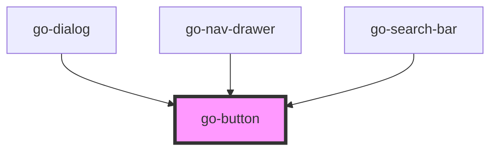

## API

<!-- Auto Generated Below -->

## Properties

| Property      | Attribute      | Description                                                                                                                                                                                                                                 | Type                                                   | Default     |
| ------------- | -------------- | ------------------------------------------------------------------------------------------------------------------------------------------------------------------------------------------------------------------------------------------- | ------------------------------------------------------ | ----------- |
| `block`       | `block`        | If set, the button will take up the full width of its parent If block="{breakpoint}" is set, the button will take up the full width for the specified breakpoint. e.g. a `block="mobile"` button will display full width on mobile devices. | `"" \| "desktop" \| "large" \| "mobile" \| "tablet"`   | `undefined` |
| `color`       | `color`        | Color variants                                                                                                                                                                                                                              | `"critical" \| "primary" \| "secondary" \| "tertiary"` | `'primary'` |
| `compact`     | `compact`      | Reduce inner gaps and outer paddings                                                                                                                                                                                                        | `boolean`                                              | `false`     |
| `disabled`    | `disabled`     | If this button is disabled                                                                                                                                                                                                                  | `boolean`                                              | `null`      |
| `flat`        | `flat`         | If `flat` is set, the button will have no shadow and will be filled with the background color of the selected variant                                                                                                                       | `boolean`                                              | `false`     |
| `href`        | `href`         | If the button has an href, it will be rendered as an anchor tag                                                                                                                                                                             | `string`                                               | `undefined` |
| `icon`        | `icon`         | Circle shaped icon only button that has min size of 40px for touch devices                                                                                                                                                                  | `boolean`                                              | `false`     |
| `outline`     | `outline`      | If `outline` is true, the button will have a border based on selected variant                                                                                                                                                               | `boolean`                                              | `false`     |
| `outlineFill` | `outline-fill` | Outline style with filled background                                                                                                                                                                                                        | `boolean`                                              | `false`     |
| `round`       | `round`        | If button should have pill-shaped corners                                                                                                                                                                                                   | `boolean`                                              | `false`     |
| `stack`       | `stack`        | Stack elements inside the button                                                                                                                                                                                                            | `boolean`                                              | `false`     |
| `type`        | `type`         | Html type of the button                                                                                                                                                                                                                     | `"button" \| "reset" \| "submit"`                      | `'button'`  |

## Slots

| Slot      | Description                                     |
| --------- | ----------------------------------------------- |
| `"end"`   | Use this slot to append content to the button.  |
| `"start"` | Use this slot to prepend content to the button. |

## Dependencies

### Used by

 - [go-dialog](../go-dialog)
 - [go-nav-drawer](../go-nav-drawer)
 - [go-search-bar](../go-search-bar)

### Graph

----------------------------------------------

