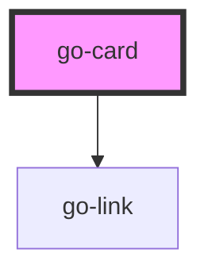

## go-card API

<!-- Auto Generated Below -->

## Properties

| Property        | Attribute        | Description                                                                                                                                                                                                                                                           | Type                                                         | Default     |
| --------------- | ---------------- | --------------------------------------------------------------------------------------------------------------------------------------------------------------------------------------------------------------------------------------------------------------------- | ------------------------------------------------------------ | ----------- |
| `cardSubtitle`  | `card-subtitle`  | Subtitle of the card                                                                                                                                                                                                                                                  | `string`                                                     | `undefined` |
| `cardTitle`     | `card-title`     | Title of the card                                                                                                                                                                                                                                                     | `string`                                                     | `undefined` |
| `href`          | `href`           | For cards that link to destinations, one card can only link to one destination. Note: The link (`a` tag) will be applied to the card-title element, so if you don't have a `card-title` prop, you will need to manually add the `a` tag in one of the slots provided. | `string`                                                     | `undefined` |
| `mediaPosition` | `media-position` | Position of featured media in the card                                                                                                                                                                                                                                | `"bottom" \| "end" \| "left" \| "right" \| "start" \| "top"` | `'top'`     |
| `target`        | `target`         | when href is present, `target` attribute to be applied to the card link                                                                                                                                                                                               | `"_blank" \| "_parent" \| "_self" \| "_top"`                 | `undefined` |

## Slots

| Slot             | Description                           |
| ---------------- | ------------------------------------- |
| `"custom-title"` | Slot for custom card title            |
| `"default"`      | Card content                          |
| `"footer"`       | Slot for card footer markup           |
| `"media"`        | Slot for media markup for media card  |
| `"pre-title"`    | Slot for content above the card title |

## Dependencies

### Depends on

- [go-link](../go-link)

### Graph

----------------------------------------------

