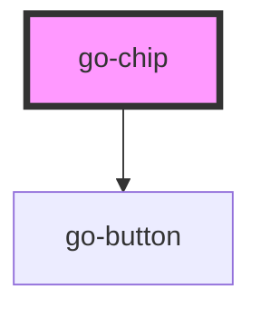

## go-chip API

<!-- Auto Generated Below -->

## Properties

| Property  | Attribute | Description                                                                   | Type                                                               | Default     |
| --------- | --------- | ----------------------------------------------------------------------------- | ------------------------------------------------------------------ | ----------- |
| `outline` | `outline` | If `outline` is true, the button will have a border based on selected variant | `boolean`                                                          | `false`     |
| `variant` | `variant` | Colour variant of the chip                                                    | `"critical" \| "neutral" \| "primary" \| "secondary" \| "success"` | `'neutral'` |

## CSS Custom Properties

| Name                     | Description                                                     |
| ------------------------ | --------------------------------------------------------------- |
| `--go-chip-border-width` | Border width of the chip - default: 1px                         |
| `--go-chip-color-bg`     | Background color of chip - default: var(--go-color-neutral-200) |
| `--go-chip-color-border` | Border color of the chip - default: transparent                 |
| `--go-chip-color-fg`     | Foreground color of chip - default: var(--go-color-text)        |
| `--go-chip-font-size`    | Font size of chip - default: var(--go-size--1)                  |
| `--go-chip-gap`          | Gap between label, prefix and suffix. - default: 0.5em          |
| `--go-chip-padding`      | Padding of the chip - default: 0.25em 0.75em                    |
| `--go-chip-radius`       | Radius of chip - default: var(--radius-2)                       |

## Dependencies

### Depends on

- [go-button](../go-button)

### Graph

----------------------------------------------

