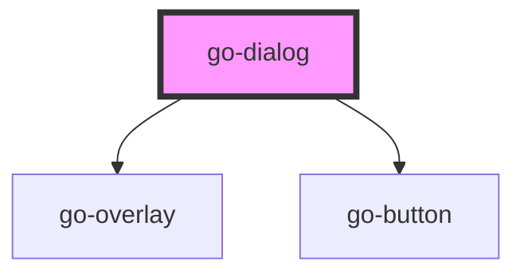

## go-dialog API

<!-- Auto Generated Below -->

## Properties

| Property     | Attribute    | Description                                                                                                 | Type      | Default     |
| ------------ | ------------ | ----------------------------------------------------------------------------------------------------------- | --------- | ----------- |
| `active`     | `active`     |                                                                                                             | `boolean` | `false`     |
| `heading`    | `heading`    | Heading of the overlay content                                                                              | `string`  | `undefined` |
| `persistent` | `persistent` | If persistent, the overlay will not be closed when the user clicks outside of it or presses the escape key. | `boolean` | `false`     |

## Methods

### `close() => Promise<void>`

#### Returns

Type: `Promise<void>`

### `open() => Promise<void>`

#### Returns

Type: `Promise<void>`

## Dependencies

### Depends on

- [go-overlay](../go-overlay)
- [go-button](../go-button)

### Graph

----------------------------------------------

