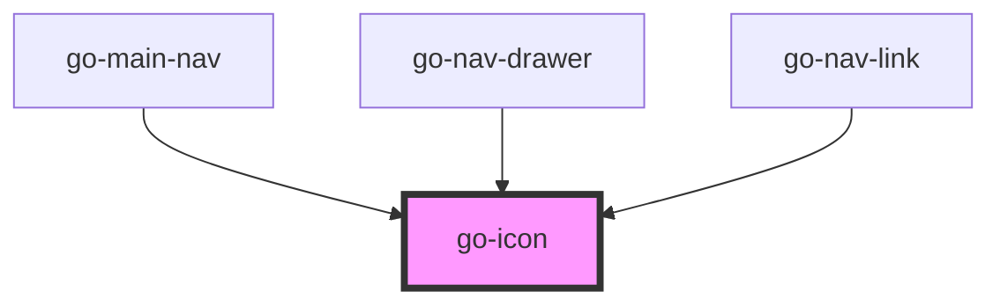

## API

<!-- Auto Generated Below -->

## Properties

| Property  | Attribute  | Description                                                                                                     | Type                                                                                                                                                                       | Default            |
| --------- | ---------- | --------------------------------------------------------------------------------------------------------------- | -------------------------------------------------------------------------------------------------------------------------------------------------------------------------- | ------------------ |
| `color`   | `color`    | Color of the icon,  supports CSS units and variables. Default: `currentColor`                                   | `string`                                                                                                                                                                   | `undefined`        |
| `iconSet` | `icon-set` | Specify the icon set being referenced. Icon font CSS files must be included in the page.                        | `"bx" \| "bxl" \| "bxs" \| "fab" \| "fad" \| "fal" \| "far" \| "fas" \| "material-icons" \| "material-icons-outlined" \| "material-icons-round" \| "material-icons-sharp"` | `'material-icons'` |
| `name`    | `name`     | Name of the icon                                                                                                | `string`                                                                                                                                                                   | `undefined`        |
| `size`    | `size`     | Size of the icon, supports CSS units and variables. Default: 1.5em for material icons, 1em for other icon sets. | `string`                                                                                                                                                                   | `undefined`        |

## Dependencies

### Used by

 - [go-main-nav](../../patterns/go-main-nav)
 - [go-nav-drawer](../go-nav-drawer)
 - [go-nav-link](../go-nav-link)

### Graph

----------------------------------------------

