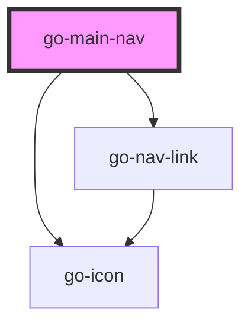

## go-main-nav API

<!-- Auto Generated Below -->

## Properties

| Property | Attribute | Description                                                                     | Type                   | Default     |
| -------- | --------- | ------------------------------------------------------------------------------- | ---------------------- | ----------- |
| `items`  | `items`   | Navigation items to be rendered if provided, slot content will not be rendered. | `INavItem[] \| string` | `undefined` |

## Events

| Event      | Description | Type               |
| ---------- | ----------- | ------------------ |
| `navigate` |             | `CustomEvent<any>` |

## Methods

### `init(newItems: INavItem[] | string) => Promise<void>`

Initialise the menu

#### Returns

Type: `Promise<void>`

## Dependencies

### Depends on

- [go-icon](../go-icon)
- [go-nav-link](../go-nav-link)

### Graph

----------------------------------------------

