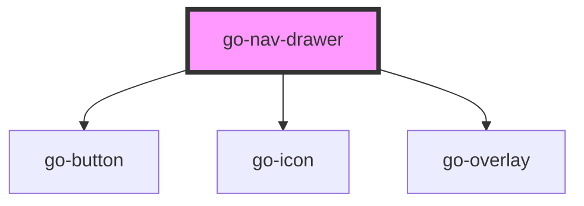

## go-nav-drawer API

<!-- Auto Generated Below -->

## Properties

| Property   | Attribute  | Description                                      | Type                   | Default     |
| ---------- | ---------- | ------------------------------------------------ | ---------------------- | ----------- |
| `active`   | `active`   |                                                  | `boolean`              | `false`     |
| `items`    | `items`    | Navigation items to be rendered                  | `INavItem[] \| string` | `undefined` |
| `label`    | `label`    |                                                  | `string`               | `'Menu'`    |
| `position` | `position` | Position where the navigation should appear from | `"left" \| "right"`    | `'left'`    |

## Events

| Event   | Description                           | Type                |
| ------- | ------------------------------------- | ------------------- |
| `close` | Emitted when the nav drawer is closed | `CustomEvent<void>` |
| `open`  | Emitted when the nav drawer is opened | `CustomEvent<void>` |

## Methods

### `close() => Promise<void>`

#### Returns

Type: `Promise<void>`

### `init(items: INavMenu) => Promise<void>`

Initialise the menu

#### Returns

Type: `Promise<void>`

### `open() => Promise<void>`

#### Returns

Type: `Promise<void>`

### `toggle() => Promise<void>`

#### Returns

Type: `Promise<void>`

## Dependencies

### Depends on

- [go-button](../go-button)
- [go-icon](../go-icon)
- [go-overlay](../go-overlay)

### Graph

----------------------------------------------

