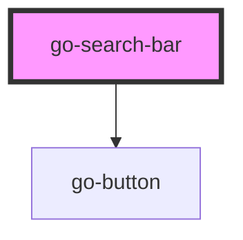

## go-search-bar API

<!-- Auto Generated Below -->

## Methods

### `closeSearchForm() => Promise<void>`

#### Returns

Type: `Promise<void>`

### `openSearchForm() => Promise<void>`

#### Returns

Type: `Promise<void>`

## Dependencies

### Depends on

- [go-button](../go-button)

### Graph

----------------------------------------------

