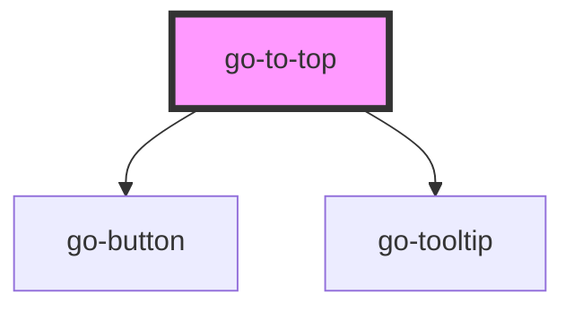

## go-to-top API

<!-- Auto Generated Below -->

## Properties

| Property | Attribute | Description                                                         | Type     | Default |
| -------- | --------- | ------------------------------------------------------------------- | -------- | ------- |
| `offset` | `offset`  | how far from the top of the page the button should be shown (in px) | `number` | `200`   |

## CSS Custom Properties

| Name                 | Description                                    |
| -------------------- | ---------------------------------------------- |
| `--go-to-top-bottom` | Bottom position of the button. - default: 2rem |
| `--go-to-top-right`  | Right position of the button. - default: 2rem  |

## Dependencies

### Depends on

- [go-button](../go-button)
- [go-tooltip](../go-tooltip)

### Graph

----------------------------------------------

