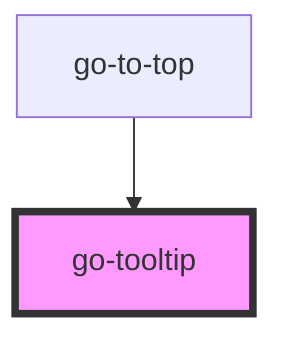

## go-tooltip API

<!-- Auto Generated Below -->

## Properties

| Property    | Attribute    | Description                                                                                                                   | Type                                     | Default     |
| ----------- | ------------ | ----------------------------------------------------------------------------------------------------------------------------- | ---------------------------------------- | ----------- |
| `arrow`     | `arrow`      | Add arrow to the tooltip                                                                                                      | `boolean`                                | `false`     |
| `inline`    | `inline`     | Improve positioning for inline trigger elements that span over multiple lines. Reference: https://floating-ui.com/docs/inline | `boolean`                                | `false`     |
| `placement` | `placement`  | placement of tooltip relative to the trigger element                                                                          | `"bottom" \| "left" \| "right" \| "top"` | `'top'`     |
| `triggerId` | `trigger-id` | Query selector string for the element inside the slot that triggers the tooltip.                                              | `string`                                 | `undefined` |

## CSS Custom Properties

| Name                 | Description                                                             |
| -------------------- | ----------------------------------------------------------------------- |
| `--tooltip-bg-color` | Background color of the tooltip. - default: var(--go-color-primary-800) |
| `--tooltip-fg-color` | Text color of the tooltip. - default: var(--go-color-lightest)          |
| `--tooltip-padding`  | Padding around tooltip - default: 0.5rem                                |
| `--tooltip-radius`   | Border radius of tooltip - default: var(--radius-2)                     |

## Dependencies

### Used by

 - [go-to-top](../go-to-top)

### Graph

----------------------------------------------

