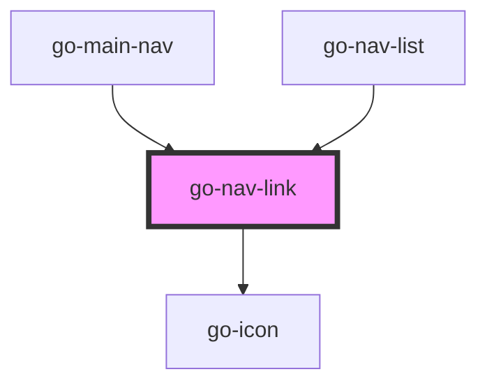

## go-nav-link API

<!-- Auto Generated Below -->

## Properties

| Property    | Attribute    | Description                       | Type       | Default     |
| ----------- | ------------ | --------------------------------- | ---------- | ----------- |
| `block`     | `block`      | full width                        | `boolean`  | `false`     |
| `item`      | --           | navigation item                   | `INavItem` | `undefined` |
| `showArrow` | `show-arrow` | show arrow at the end of the link | `boolean`  | `false`     |

## Events

| Event      | Description | Type               |
| ---------- | ----------- | ------------------ |
| `navigate` |             | `CustomEvent<any>` |

## Dependencies

### Used by

 - [go-main-nav](../go-main-nav)
 - [go-nav-list](../go-nav-list)

### Depends on

- [go-icon](../../go-icon)

### Graph

----------------------------------------------

