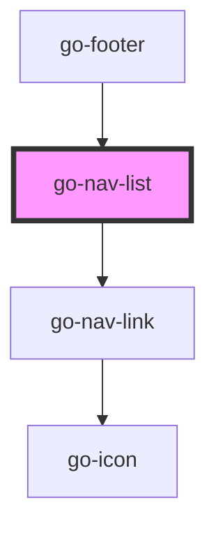

## go-nav-list API

<!-- Auto Generated Below -->

## Properties

| Property      | Attribute      | Description                              | Type                   | Default     |
| ------------- | -------------- | ---------------------------------------- | ---------------------- | ----------- |
| `block`       | `block`        | Make the list full width                 | `boolean`              | `false`     |
| `heading`     | `heading`      | Heading text                             | `string`               | `undefined` |
| `headingItem` | `heading-item` | Heading navigation item                  | `INavItem \| string`   | `undefined` |
| `items`       | `items`        | list of navigation items to be displayed | `INavItem[] \| string` | `undefined` |

## Dependencies

### Used by

 - [go-footer](../../../patterns/footer)

### Depends on

- [go-nav-link](../go-nav-link)

### Graph

----------------------------------------------

