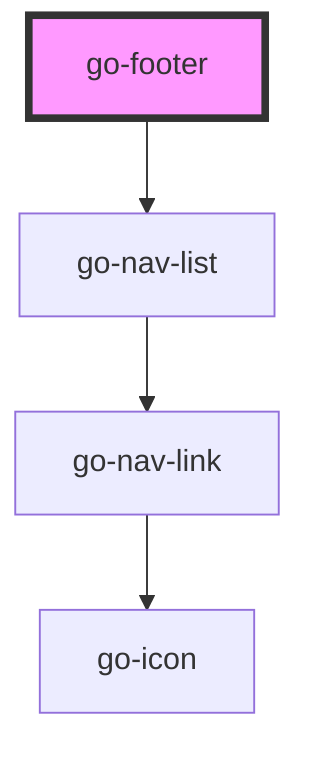

## footer API

<!-- Auto Generated Below -->

## Properties

| Property | Attribute | Description | Type         | Default     |
| -------- | --------- | ----------- | ------------ | ----------- |
| `items`  | --        |             | `INavItem[]` | `undefined` |

## Dependencies

### Depends on

- [go-nav-list](../../components/go-nav-list)

### Graph

----------------------------------------------

